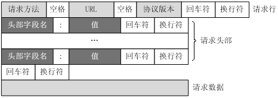

# tomcat配置

## server.xml

conf文件夹下的加入配置项

```
<Context docBase="F:\tomcat8\apache-tomcat-9.0.30-windows-x64\apache-tomcat-9.0.30\webapps\examples" path="/coby/"/>
```

虚拟路径/coby/

磁盘路径F:\tomcat8\apache-tomcat-9.0.30-windows-x64\apache-tomcat-9.0.30\webapps\examples

## webapps文件夹

直接放进tomcat服务器内部webapps文件夹的项目，不用改server.xml

ROOT文件夹为默认根目录

其他为子级目录

## web.xml

修改欢迎页面（idea默认不显示，tomcat的conf下的web.xml最下面有，所以idea可以手动加）

```xml
<welcome-file-list>
    <welcome-file>index.html</welcome-file>
    <welcome-file>index.htm</welcome-file>
    <welcome-file>index.jsp</welcome-file>
</welcome-file-list>
```

配置servlet（虚拟路径绑javaServlet类）

```xml
<servlet>
    <servlet-name>Demo1</servlet-name>
    <servlet-class>cn.cobight.TestDemo1</servlet-class>
</servlet>
<servlet-mapping>
    <servlet-name>Demo1</servlet-name>
    <url-pattern>/demo1</url-pattern>
</servlet-mapping>
```

文件类型的响应头，mimetype配置

```
太多了，放弃CV
```

# HTTP

标准格式：http(s)://host:port/path?参数键值对K=V&K=V&...#锚点

## URI

是uniform resource identifier，统一资源标识符，用来唯一的标识一个资源。

Web上可用的每种资源如HTML文档、图像、视频片段、程序等都是一个来URI来定位的
URI一般由三部组成：
①访问资源的命名机制
②存放资源的主机名
③资源自身的名称，由路径表示，着重强调于资源。

## URL

是uniform resource locator，统一资源定位器，它是一种具体的URI，即URL可以用来标识一个资源，而且还指明了如何locate这个资源。

URL是Internet上用来描述信息资源的字符串，主要用在各种WWW客户程序和服务器程序上，特别是著名的Mosaic。
采用URL可以用一种统一的格式来描述各种信息资源，包括文件、服务器的地址和目录等。URL一般由三部组成：
①协议(或称为服务方式)
②存有该资源的主机IP地址(有时也包括端口号)
③主机资源的具体地址。如目录和文件名等

## URN

uniform resource name，统一资源命名，是通过名字来标识资源，比如mailto:java-net@java.sun.com。

URI是以一种抽象的，高层次概念定义统一资源标识，而URL和URN则是具体的资源标识的方式。URL和URN都是一种URI。笼统地说，每个 URL 都是 URI，但不一定每个 URI 都是 URL。这是因为 URI 还包括一个子类，即统一资源名称 (URN)，它命名资源但不指定如何定位资源。上面的 mailto、news 和 isbn URI 都是 URN 的示例。

在Java的URI中，一个URI实例可以代表绝对的，也可以是相对的，只要它符合URI的语法规则。而URL类则不仅符合语义，还包含了定位该资源的信息，因此它不能是相对的。
在Java类库中，URI类不包含任何访问资源的方法，它唯一的作用就是解析。
相反的是，URL类可以打开一个到达资源的流。

## HTTP之请求消息Request

客户端发送一个HTTP请求到服务器的请求消息包括以下格式：

### 请求行（request line）、请求头部（header）、空行和请求数据四个部分组成。





Http请求消息结构.png

- 请求行以一个方法符号开头，以空格分开，后面跟着请求的URI和协议的版本。

**Get请求例子，使用Charles抓取的request：**

```
GET /562f25980001b1b106000338.jpg HTTP/1.1
Host    img.mukewang.com
User-Agent    Mozilla/5.0 (Windows NT 10.0; WOW64) AppleWebKit/537.36 (KHTML, like Gecko) Chrome/51.0.2704.106 Safari/537.36
Accept    image/webp,image/*,*/*;q=0.8
Referer    http://www.imooc.com/
Accept-Encoding    gzip, deflate, sdch
Accept-Language    zh-CN,zh;q=0.8
```

**第一部分：请求行，用来说明请求类型,要访问的资源以及所使用的HTTP版本.**

GET说明请求类型为GET,[/562f25980001b1b106000338.jpg]为要访问的资源，该行的最后一部分说明使用的是HTTP1.1版本。

**第二部分：请求头部，紧接着请求行（即第一行）之后的部分，用来说明服务器要使用的附加信息**

从第二行起为请求头部，HOST将指出请求的目的地.User-Agent,服务器端和客户端脚本都能访问它,它是浏览器类型检测逻辑的重要基础.该信息由你的浏览器来定义,并且在每个请求中自动发送等等

**第三部分：空行，请求头部后面的空行是必须的**

即使第四部分的请求数据为空，也必须有空行。

**第四部分：请求数据也叫主体，可以添加任意的其他数据。**

这个例子的请求数据为空。

**POST请求例子，使用Charles抓取的request：**

```
POST / HTTP1.1
Host:www.wrox.com
User-Agent:Mozilla/4.0 (compatible; MSIE 6.0; Windows NT 5.1; SV1; .NET CLR 2.0.50727; .NET CLR 3.0.04506.648; .NET CLR 3.5.21022)
Content-Type:application/x-www-form-urlencoded
Content-Length:40
Connection: Keep-Alive

name=Professional%20Ajax&publisher=Wiley
```

第一部分：请求行，第一行明了是post请求，以及http1.1版本。
第二部分：请求头部，第二行至第六行。
第三部分：空行，第七行的空行。
第四部分：请求数据，第八行。

## HTTP之响应消息Response

一般情况下，服务器接收并处理客户端发过来的请求后会返回一个HTTP的响应消息。

**HTTP响应也由四个部分组成，分别是：状态行、消息报头、空行和响应正文。**

 


http响应消息格式.jpg

**例子**

```
HTTP/1.1 200 OK
Date: Fri, 22 May 2009 06:07:21 GMT
Content-Type: text/html; charset=UTF-8

<html>
      <head></head>
      <body>
            <!--body goes here-->
      </body>
</html>
```

**第一部分：状态行，由HTTP协议版本号， 状态码， 状态消息 三部分组成。**

第一行为状态行，（HTTP/1.1）表明HTTP版本为1.1版本，状态码为200，状态消息为（ok）

**第二部分：消息报头，用来说明客户端要使用的一些附加信息**

第二行和第三行为消息报头，
Date:生成响应的日期和时间；Content-Type:指定了MIME类型的HTML(text/html),编码类型是UTF-8

**第三部分：空行，消息报头后面的空行是必须的**

**第四部分：响应正文，服务器返回给客户端的文本信息。**

空行后面的html部分为响应正文。

### HTTP之状态码

状态代码有三位数字组成，第一个数字定义了响应的类别，共分五种类别:

###### 1xx：指示信息--表示请求已接收，继续处理

###### 2xx：成功--表示请求已被成功接收、理解、接受

###### 3xx：重定向--要完成请求必须进行更进一步的操作

###### 4xx：客户端错误--请求有语法错误或请求无法实现

###### 5xx：服务器端错误--服务器未能实现合法的请求

常见状态码：

```
200 OK                        //客户端请求成功
400 Bad Request               //客户端请求有语法错误，不能被服务器所理解
401 Unauthorized              //请求未经授权，这个状态代码必须和WWW-Authenticate报头域一起使用 
403 Forbidden                 //服务器收到请求，但是拒绝提供服务
404 Not Found                 //请求资源不存在，eg：输入了错误的URL
500 Internal Server Error     //服务器发生不可预期的错误
503 Server Unavailable        //服务器当前不能处理客户端的请求，一段时间后可能恢复正常
```


# 运行空间

idea会把项目打包到工作空间C:\Users\GL62 1252\.IntelliJIdea2019.3\system\tomcat

src下的java代码会编译到工作空间的web文件夹下的WEB-INF下的classes文件夹下

所以WEB-INF目录无法通过浏览器访问

# jsp

```jsp
<%!
	用来定义方法与全局变量的定义
%>
<%=赋值表达式%>
<%
	java代码区
%>
```


注释

```jsp
<%--既有java代码，又有html标签 --%>
<!-- html代码 -->
//java代码 /* */
```

## 代码的特殊写法

```jsp
<%@
	for(int i=0;i<10;i++){
%>
<tr>
	<td><%=arr[i]%></td>
</tr>
<%@
	}
%>
```

## 指令

```jsp
<$@ 指令名称 key="value" key="value"%>
```

jsp包含三大指令，分别是page,taglib,include 指令；

我们知道jsp都会被编译成java文件，指令在Java文件中不存在，但是会根据指令来翻译成Java文件；

Tomcat编译系统会根据JSP的指令信息来编译JSP，生成Java文件。

在生成的Java文件中，不存在指令信息！

（1）page指令

常用属性：

a-->pageEncoding

pageEncoding指定的是当前JSP页面的编码！Tomcat编译系统会使用这个编码把JSP编译成Java文件。所以这个编译只需要与真实的页面编译一致即可！

b-->contentType

contentType指定的是响应给我客户端时使用的编码，tomcat都会把响应正文转换成UTF-8编译，然后发送给我客户端，并且会在响应头中设置Content-Type头信息为text/html;charset=utf-8，这样浏览器就知道使用服务器发送过来的正文使用了什么编码。

注意：两者要一致；

c-->import

import是page指令中一个很特别的属性！

import属性值对应“Java”中的import语句。

import属性值可以使逗号：<%@page import=”java.net.*,java.util.*,java.sql.*”%>

import属性是唯一可以重复出现的属性：

但是，我们一般会使用多个page指令来导入多个包：

<%@ page import=”java.util.*”%>

<%@ page import=”java.net.*”%>

<%@ page import=”java.text.*”%>

d-->errorPage

我们知道，在一个JSP页面出错后，Tomcat会响应给我用户错误信息！如果你不希望Tomcat给用户输出错误信息，那么可以使用page指令的errorPage来指定错误页！例如：

<%@page errorPage=”xxx.jsp”%>

这时，在当前JSP页面出现错误时，会转发到xxx.jsp页面。

e-->isErrorPage

如果希望在b.jsp页面中获得异常对象，那么就需要把b.jsp标记为错误页！这需要设置page指令的isErrorPage属性为true。

```
<%@ page language="java" import="java.util.*" pageEncoding="UTF-8"%>

<%@ page  isErrorPage="true" %>

<html>

  <body>

   <h1>出错啦！</h1>

    <%=exception.getMessage() %>

  </body>

</html>
```

必须设置page指令的isErrorPage为TRUE,exception对象才可以识别；

注意还可以在web.xml 中设置错误页面：

```
  <error-page>

    <error-code>404</error-code>

    <location>/error404.jsp</location>

  </error-page>

  <error-page>

    <error-code>500</error-code>

    <location>/error500.jsp</location>

  </error-page>
```


（2）taglib指令

在JSP页面中使用第三方的标签库时，需要使用taglib指令来“导包”。

el表达式和jstl标签

下载jstl-1.2jar包

prefix-->前缀

suffix-->后缀

导入到项目中；

```
<%@taglib prefix="fmt" uri="http://java.sun.com/jsp/jstl/fmt" %>
<%
    String path = request.getContextPath();
    String basePath = request.getScheme() + "://" + request.getServerName() + ":" + request.getServerPort() + path + "/";
%>
<!DOCTYPE HTML PUBLIC "-//W3C//DTD HTML 4.01 Transitional//EN">
<html>
<head>
    <base href="<%=basePath%>">
    <title>测试taglib</title>
</head>
<body>
<%
    Date date = new Date();
%>
<fmt:formatDate value="<%=date%>" pattern="yyyy-MM-dd"></fmt:formatDate>
</body>
</html>
```


（3）include指令

```
include指令只有一个属性：file，指定要包含的页面，例如：<%@include file=”b.jsp”%>。
```

静态包含，两个页面最终会合成一个页面，所以不能有重复的变量，最终会翻译成一个.java文件

## 2、动作

<jsp:forward>

转发；

<jsp:include>

是动态包含，两个页面各自编译，生成两个不同的Java文件，在执行时再包含进来；

***\*1.\****动态包含用的元素是page，静态包含用的是file,只有一种形式。

***\*2.\****生成的文件不同，静态的包含是将两个jsp文件二合一，生成一个以包含页面命名的servlet和class文件，动态包含的两个jsp文件各自生成自己的servlet和class文件。

是两个文件分别翻译成两个Java文件，在访问的时候才会两个文件合并到一块进行显示；

静态包含：最好静态页面资源的整合包含；

动态包含：最好是动态内容的整合；

## 3、请求和响应

request  response 

## 4、隐式对象(jsp九大内置对象四大作用域)

内置对象--》不用new就可以直接拿来使用；

out   request  response  session pageContext  application 

page config  exception

### 4.1out--》直接向浏览器页面输出内容；

### 4.2request--》浏览器向服务器发送的一次请求，就会创建一个request对象，请求包含的信息都封装到request对象中；

 常用的方法：

| 常用方法                                 | 方法介绍                         |
| ---------------------------------------- | -------------------------------- |
| String getParameter(String name)         | 返回name指定参数的参数值         |
| String[] getParameterValues(String name) | 返回包含参数name的所有值的数组   |
| void setAttribute(String,Object)         | 存储此请求中的属性               |
| Object getAttribute(String name)         | 返回指定属性的属性值             |
| String getContentType()                  | 得到请求体的MIME类型             |
| String getProtocol()                     | 返回请求用的协议类型及版本号     |
| String getServerName()                   | 返回接受请求的服务器主机名       |
| int getServerPort()                      | 返回服务器接受此请求所用的端口号 |
| String getCharacterEncoding()            | 返回字符编码方式                 |
| void setCharacterEncoding()              | 设置请求的字符编码方式           |
| int getContentLength()                   | 返回请求体的长度(以字节数)       |
| String getRemoteAddr()                   | 返回发送此请求的客户端IP地址     |
| String getRealPath(String path)          | 返回一虚拟路径的真实路径         |
| String request.getContextPath()          | 返回上下文路径                   |

案例：简单注册

reg.jsp

```
<form action="requestdemo/show.jsp" method="post">
    用户名：<input type="text" name="username"> <br>
    性别；
    <select name="sex">
        <option value="1">男</option>
        <option value="0">女</option>
    </select>
    <br>
    爱好：
    <input type="checkbox" name="hobby" value="swim"/>游泳
    <input type="checkbox" name="hobby" value="basketball"/>篮球
    <input type="checkbox" name="hobby" value="reading"/>读书
    <br>
<input type="submit" value="提交"/>
<input type="reset" value="重置"/>
</form>
```

show.jsp

```
<body>
内置对象request的基本信息：
request.getContextPath():
<%=request.getContextPath()%>
<br>
request.getScheme():
<%=request.getScheme()%>
<br>
request.getServerName():
<%=request.getServerName()%>
<br>
request.getProtocol():
<%=request.getProtocol()%>
<br>
request.getServerPort():
<%=request.getServerPort()%>
<br>
String getRealPath(String path):
<%=request.getRealPath("/")%>
<br>
String getRemoteAddr():
<%=request.getRemoteAddr()%>
<br>
<%
    request.setCharacterEncoding("utf-8");
String uname = request.getParameter("username");
int sex = Integer.parseInt(request.getParameter("sex"));
String[] hs = request.getParameterValues("hobby");
out.print(uname+"<br>");
out.print(sex+"<br>");
if(null != hs && hs.length>0){
    for (String h : hs) {
        out.print(h+"<br>");
    }
}


%>

</body>
```


### 4.3response--》服务器对客户端的请求给予响应；

```
void addCookie(Cookie cokie cookie)                          在客户端添加cookie
void setContentType(String type)                     设置HTTP响应的contentType类型           void setCharacterEncoding(String charset)                    设置响应所采用的字符编码类型        void sendRedirect(String location)                      将请求重新定位到一个新的URL上                                                                                                 
```

重定向到网页演示：

```
<h2>我是A页面</h2>
跳转到B
<%
    request.setAttribute("name","岳勇宏");
    //response.sendRedirect("b.jsp");
    request.getRequestDispatcher("b.jsp").forward(request,response);
%>


<h2>我是B页面</h2>
<%
    String name = (String)request.getAttribute("name");
%>
<%=name%>
```

区别：

重定向：地址栏变化，不能共享请求中的数据，是让浏览器重新定位资源；

转发：地址栏不变化，是在服务器内部重新找资源，共享请求中的数据；

禁用缓存

```
<% response.setHeader("Cache-Control", "no-store");
	   response.setDateHeader("Expires", 0);%>
```


网页自动刷新

```
<% response.setHeader("refresh", "10");%>

<% response.setHeader("refresh", "3;url=http://www.baidu.com");%>
```

设置相应类型的数类类别：

```
<%
response.setContentType("text/html;charset=utf-8")
%>
```


### 4.4session

session 对象是由服务器自动创建的与用户请求相关的对象。服务器为每个用户都生成一个session对象，用于保存该用户的信息，跟踪用户的操作状态。session对象内部使用Map类来保存数据，因此保存数据的格式为 “Key/value”。 session对象的value可以使复杂的对象类型，而不仅仅局限于字符串类型。

### 4.5pageContext

pageContext 对象的作用是取得任何范围的参数，通过它可以获取 JSP页面的out、request、reponse、session、application 等对象。pageContext对象的创建和初始化都是由容器来完成的，在JSP页面中可以直接使用 pageContext对象。

### 4.6application

 application 对象可将信息保存在服务器中，直到服务器关闭，否则application对象中保存的信息会在整个应用中都有效。与session对象相比，application对象生命周期更长，类似于系统的“全局变量”。

### 4.7page

page 对象代表JSP本身，只有在JSP页面内才是合法的。 page隐含对象本质上包含当前 Servlet接口引用的变量，类似于Java编程中的 this 指针。

### 4.8config

config 对象的主要作用是取得服务器的配置信息。通过 pageConext对象的 getServletConfig() 方法可以获取一个config对象。当一个Servlet 初始化时，容器把某些信息通过 config对象传递给这个 Servlet。 开发者可以在web.xml 文件中为应用程序环境中的Servlet程序和JSP页面提供初始化参数。

### 4.9exception：用来封装产生的异常对象，但是只有页面设置了

```
<%@page isErrorPage="true"%>
```

exception才有效；


## 5、统一编码方式

get请求：在server.xml文件中设置

```
    <Connector port="8080" protocol="HTTP/1.1"
               connectionTimeout="20000"
               redirectPort="8443" URIEncoding="UTF-8"/>
```

单独设置

```
String name = new String(name.getBytes("iso-8859-1"),"utf-8");
```


post请求：

```
request.setCharacterEncoding("utf-8");
```


## 6、案例

如何添加jar包到项目中？

第一步；通过project structure,添加到项目中

第二步：通过artifacts，这是添加到war包中

实现用户管理系统的增删改查；

添加的业务流程：点击添加链接，到达添加页面，编写添加页面，填写信息，点击添加按钮，达到添加业务处理页面，处理成功，跳转到显示页面；

修改的业务流程：点击修改链接，连接里面穿id参数，发送请求到servlet，根据id去查找原来的用于信息，

封装到request，里面，转发到修改页面；

在修改页面，显示原来的信息，在原来的信息的基础上进行修改；

删除的业务流程：点击删除链接，直接进入删除业务处理，然后跳转到显示页面；


查询业务：--》请求servlet，servlet去数据库查找到所有的用户，然后把用户的对象传到jsp中，jsp循环显示；

--》servlet-->show.jsp

# Servlet

1、什么是servlet？

运行在服务器端的小程序；

运行在服务器端的脚本；

一样：jsp就是servlet无非表现形式不一样而已；

用的是servlet，做控制层--》接受请求，调用不同的model去处理，处理完毕后再去响应给客户端；

用jsp做显示层；

2、如何定义一个servlet？

创建一个servlet然后继承了HttpServlet，HttpServlet是GenericServlet的子类，实现了Servlet接口；

需要重写doget,dopost 方法；

然后去web.xml文件中配置；

定义一个servlet

```
public class IndexServlet extends HttpServlet {
    @Override
    protected void doGet(HttpServletRequest req, HttpServletResponse resp) throws ServletException, IOException {
        this.doPost(req,resp);
    }

    @Override
    protected void doPost(HttpServletRequest req, HttpServletResponse resp) throws ServletException, IOException {
       //重定向--》重新定位新的资源
        resp.sendRedirect("hello.jsp");
    }
}
```

注册servlet

```
 <servlet>
        <servlet-name>aaa</servlet-name>
        <!--全限定类名-->
        <servlet-class>day810.controller.IndexServlet</servlet-class>
    </servlet>
    <servlet-mapping>
        <servlet-name>aaa</servlet-name>
        <url-pattern>/index</url-pattern>
    </servlet-mapping>
```


3、注解的方式

```
@WebServlet({"/hi","/hello"})
public class UserServlet extends HttpServlet {
    @Override
    protected void doGet(HttpServletRequest req, HttpServletResponse resp) throws ServletException, IOException {
        this.doPost(req,resp);
    }

    @Override
    protected void doPost(HttpServletRequest req, HttpServletResponse resp) throws ServletException, IOException {
        //重定向--》重新定位新的资源
        resp.sendRedirect("hello.jsp");
    }
}

```

如果配置的路径有多个，必须加{},中间使用逗号隔开；

name=“” （对应web.xml的servlet-name）

value同下

urlPatterns = “/url.path” （可以配多个路径用大括号；若是只有一个路径，可以省略大括号）

loadOnStartup=1

**通配符+路径**

@Webservlet（“/url/*”）匹配url路径下的所有路径

@Webservlet（"/*"）匹配所有路径

@Webservlet（"/*.do"）匹配子级目录是do为后缀的

4、servlet的生命周期

加载--》根据你的web.xml文件的配置进行加载类文件；

实例化--》调用servlet的构造方法，去实例化一个servlet的对象；

初始化--》参数初始化

服务--》service（）--》doget   dopost

销毁-->Tomcat关闭的时候servlet销毁；

加载--》实例化--》初始化 只进行一次；

# HttpServlet

doget处理get请求

dopost处理post请求

## 请求Request

### 获取参数

String name = req.getParameter("name");


### 请求的属性读写

```java
req.setAttribute("msg","no");
String retn=req.getAttribute("msg");
```

### 请求转发

```java
req.getRequestDispatcher("/Users/showall.jsp").forward(req,resp);//或者不带参数，直接访问，去掉forward
```

### ServletContext

```
网页1：ServletContext con1 = this.getServletContext();
	  con1.setAttribute("msg","haha");
网页2：ServletContext con2 = this.getServletContext();
      Object msg=con2.getAttribute("msg");
      con2.removeAttribute("msg")
网页3：ServletContext con2 = this.getServletContext();
      String a=con2.getRealPath("/WEB-INF/classes/a.png");//src下
      String b=con2.getRealPath("/第二个.png");//web下
      String c=con2.getRealPath("/WEB-INF/c.png");//web-inf下
      System.out.println(a);
      System.out.println(b);
      System.out.println(c);
```

### 文件下载的请求

##### 工具类

不同浏览器有不同兼容性，所以

```java
public static String getFileName(String agent,String filename) throws UnsupportedEncodingException {
    if( agent.contains("MSIE")){
        filename= URLEncoder.encode(filename,"utf-8");
        filename=filename.replace("+"," ");
    } else if (agent.contains("Firefox")){
        BASE64Encoder base64Encoder = new BASE64Encoder();
        filename="=?utf-8?B?"+base64Encoder.encode(filename.getBytes("utf-8"))+"?=";
    }else{
        filename=URLEncoder.encode(filename,"utf-8");
    }
    return filename;
}
```


```java
@webservlet（/img）
    *
    *
String filename= req.getParameter("filename");
ServletContext con=this.getServletContext();
String realpath = con.getRealPath("/img/"+filename);
System.out.println(realpath);
FileInputStream fi=new FileInputStream(realpath);

String mimeType=con.getMimeType(filename);
System.out.println(mimeType);
resp.setHeader("content-type",mimeType);

String agent=req.getHeader("User-Agent");
System.out.println(agent);
filename= DownLoadUtils.getFileName(agent,filename);

resp.setHeader("content-disposition","attachment;filename="+filename);

ServletOutputStream sos = resp.getOutputStream();
byte[] buff = new byte[1024*8];
int len=0;
while((len=fi.read(buff))!=-1){
    sos.write(buff,0,len);
}
fi.close();
sos.close();
```

## 响应

### 获取输出对象

```java
PrintWriter out = resp.getWriter();
```

### 获取输出流

```java
ServletOutputStream sos = resp.getOutputStream();
```

### 重定向

```java
resp.sendRedirect("/dem1/responseDemo2");
```

## Cookie

#### 创建

```java
Cookie c1=new Cookie("msg","hello");
c1.setMaxAge(30);//30秒后没了
Cookie c2=new Cookie("name","fucu");
c2.setMaxAge(-1);//关浏览器就没了
resp.addCookie(c1);
resp.addCookie(c2);
```

#### 输出

```java
Cookie[] cs = req.getCookies();
if(cs!=null){
    for(Cookie c : cs){
        System.out.println(c.getName()+":"+c.getValue());
    }
}
```

#### 清空

```java
Cookie[] cs=req.getCookies();
if (cs!=null){
    for (Cookie c:cs){
        Cookie lsc=c;
        lsc.setMaxAge(0);
        resp.addCookie(lsc);
    }
}
```

### Session

#### 创建与赋值

```java
HttpSession session = req.getSession();
Object user=***;
session.setAttribute("loginstate","false");
session.setAttribute("key",user);

```

#### 获取

```java
HttpSession session = request.getSession();
if(session.getAttribute("key")!=null){
    User usr=(User)session.getAttribute("key");
}
```

